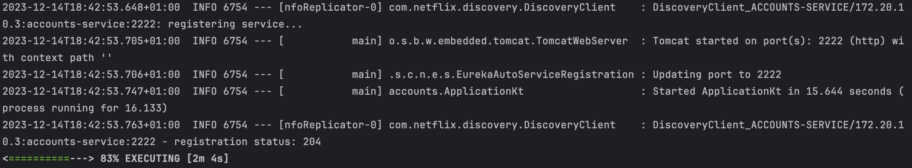
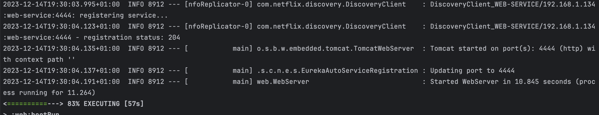
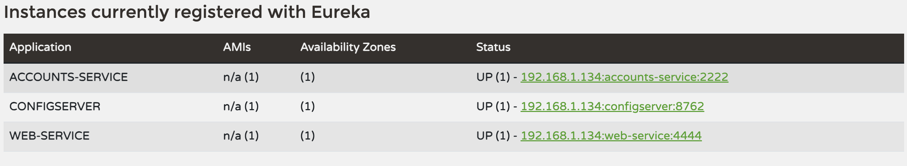
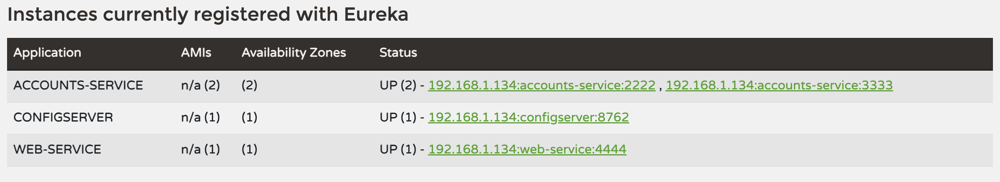
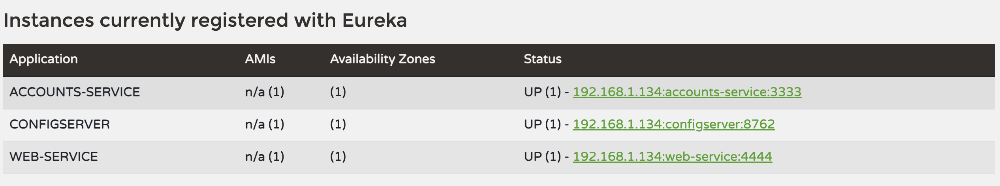
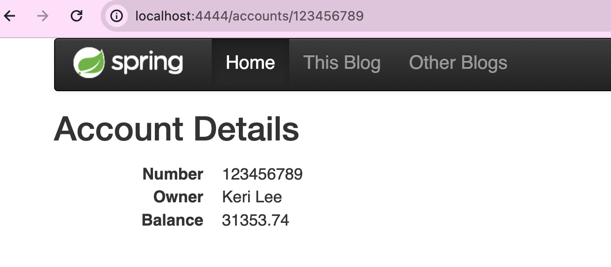

# Lab 6 - Microservices

## Configuration repository

The following repository contains the configuration files for the microservices of the project: https://github.com/leonormurphy/lab6-microservices-config-repo

## Running services

Accounts is running on port 2222::

web is running on port 4444:

## Eureka dashboard

The service registration service has these two services registered.

## Update to the accounts repository

The accounts service now uses the port 3333: https://github.com/leonormurphy/lab6-microservices-config-repo/commit/8ec21b11fce15dd129e9b5ba647d8ed2e980c434

## New instance of accounts using new port

If we run a new instance of accounts, it will use the new port 3333 and will be registered in the Eureka dashboard.
](images/newAccounts.png)

## Requests to web

Killing the service running on port 2222 simulates a failure scenario. Despite this, the web service can still make requests to the accounts service running on port 3333 because it's still available.

## Providing information about the accounts

The web service can still provide information about accounts even after killing the service running on port 2222. This is possible because the web service is configured to discover the accounts service instances through Eureka, and the instance running on port 3333 is still available.

